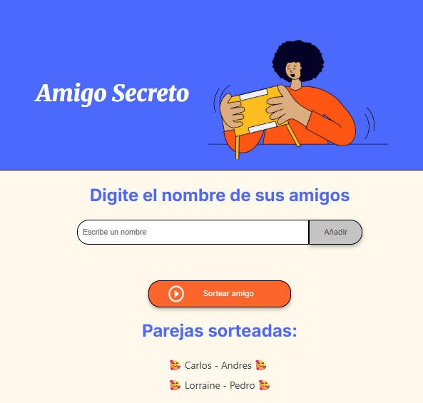
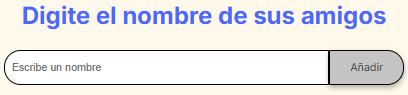
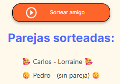

# Descripción
Este poryecto es para afianzar el conocimiento adquirido, se realiza una aplicación que agrega personas y despues genera una pareja con sus respectivos amigos secretos

## Vista previa


## Características

**Agregar amigos** Crea una lista de las personas que se van añadiendo
**Sortear amigo** Genera una lista que coloca de manera aleatoria las parejas de amigo secreto,
    -  **Listas impares** la persona que no este con pareja mostrará un mensaje **sin pareja**

## Estructura del proyecto
``` bash
├── assets      # Imagenes y recursos
├── app.js      # Lógica de los botones
├── index.html  # Estructura HTML principal
├── style.css   # Estilos de la aplicación
└──  README.md  # Documentación del proyecto
```

## Tecnologías utilizadas

- **HTML5**
- **CSS3**
- **Javascript**
- **Google Fonts**

## Como usarlo

1. **Clonar el repositorio
```bash
git clone https://github.com/cristianmorac/Challenge-amigoSecreto.git
cd Challenge-amigoSecreto
```
2. Abre `index.html` en tu navegador:
    - Escribe un nombre en el input
    - Haz clic en **Añadir** para agregar a la lista
    - Cuando tengo una lista mayor a 2 nombres haz clic en **Sortear amigo**
    - Muestra un mensaje de las parejas que se forman aleatoriamente

### Ejemplo de uso

1. Se agregan los sisguientes amigos
    - [Carlos, Padro, Lorraine]
    


2. Clic en sortear amigos



